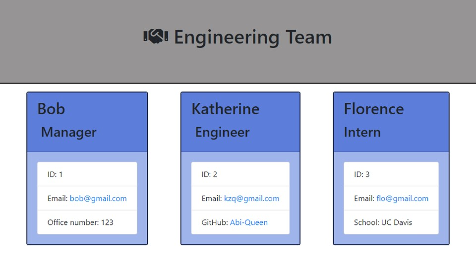

# Software Engineering Team Profiles (OOP, TDD)

## Description
This project is a Node.js application that uses a command-line interface to accept user input and then utilize that input to generate an HTML page. When a user starts the command-line application, they are prompted to enter information about their team members. When they have entered the information, a formatted HTML page displaying the team members' information is generated. The application uses Object-Oriented Programming and Test-Driven Development (with Jest). 

## Video demo
The app is demonstrated in this [video walkthrough](https://youtu.be/ut7UswYo3GU).

## GitHub
Here is the [GitHub repo](https://github.com/Abi-Queen/engineers). 

## Contributors
This project was created by [Abigail Queen](https://github.com/Abi-Queen) with help from UC Davis Bootcamp tutor Erik Hirsch.

Other resources utilized:
- [UC Davis Coding Bootcamp 2022](https://bootcamp.ucdavis.edu/): Modules 9 and 10
- [W3 Schools: The .map and .join Methods](https://www.w3schools.com/)

## Date
Created in November 2022.